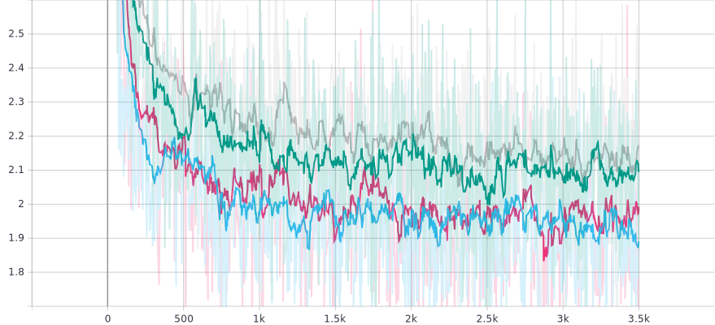
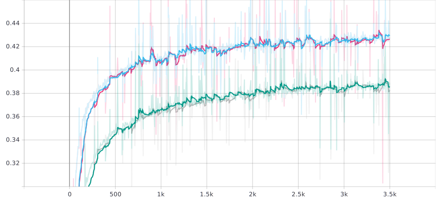
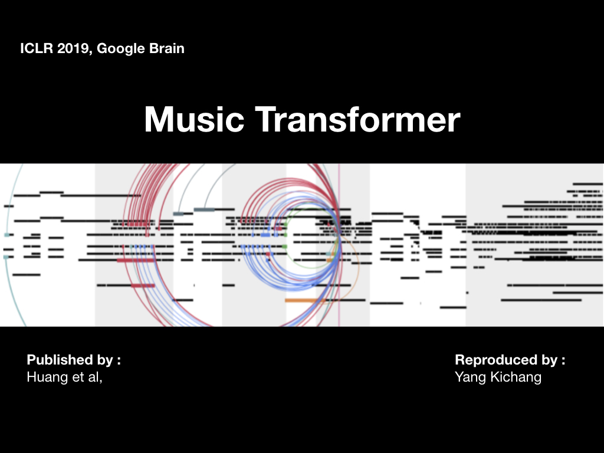

# Music Transformer: Generating Music with Long-Term Structure

- 2019 ICLR, Cheng-Zhi Anna Huang, Google Brain
- Re-producer : Yang-Kichang
- [paper link](https://arxiv.org/abs/1809.04281) 
- [paper review](https://github.com/SSUHan/PaparReviews/issues/13)


## Abstract

1. This Repository is perfectly compatible with **tensorflow 2.0**
2. If you want pytorch version, see [here](https://github.com/jason9693/MusicTransformer-pytorch)


## Contribution

* Domain: Dramatically reduces the memory footprint, allowing it to scale to musical sequences on the order of minutes.
* Algorithm: Reduced space complexity of Transformer from O(N^2D) to O(ND).


## Preprocessing

* In this repository using single track method (2nd method in paper.).

* If you want to get implementation of method 1, see [here](https://github.com/COMP6248-Reproducability-Challenge/music-transformer-comp6248) .

* ~~I refered preprocess code from [performaceRNN re-built repository.](https://github.com/djosix/Performance-RNN-PyTorch).~~

* Preprocess implementation repository is [here](https://github.com/jason9693/midi-neural-processor).

  
  


## Repository Setting
```bash
$ git clone https://github.com/jason9693/MusicTransformer-tensorflow2.0.git
$ cd MusicTransformer-tensorflow2.0
$ git clone https://github.com/jason9693/midi-neural-processor.git
$ mv midi-neural-processor midi_processor
```


## Midi Download	

```bash
$ sh dataset/script/{ecomp_piano_downloader, midi_world_downloader, ...}.sh
```

* These shell files are from [performaceRNN re-built repository](https://github.com/djosix/Performance-RNN-PyTorch) implemented by [djosix](https://github.com/djosix)


## Prepare Dataset	

```bash
$ python preprocess.py {midi_load_dir} {dataset_save_dir}
```


## Trainig

* ~~Train with Encoder & Decoder architecture ( original transformer architecture )~~

  -> original transformer model is **not compatible** with **music generation** task. ( attention map is entangled ) 

  -> If you wanna see this model, see `MusicTransformer`  class in `model.py`

* Train with only Decoder wise ( only self-attention AR. )

  ```bash
  $ python train.py --epochs={NUM_EPOCHS} --load_path={NONE_OR_LOADING_DIR} --save_path={SAVING_DIR} --max_seq={SEQ_LENGTH} --pickle_dir={DATA_PATH} --batch_size={BATCH_SIZE} --l_r={LEARNING_RATE}
  ```

  

## Hyper Parameter

* learning rate : Scheduled learning rate ( see: [CustomSchedule](custom/callback.py) )
* head size : 4
* number of layers : 6
* seqence length : 2048
* embedding dim : 256 (dh = 256 / 4 = 64)
* batch size : 2


## Result

-  Baseline Transformer ( Green, Gray Color ) vs Music Transformer ( Blue, Red Color )

* Loss

  

* Accuracy

  


## Generate Music

* mt.generate() can generate music automatically.

  ```python
  from model import MusicTransformerDecoder
  mt = MusicTransformerDecoder(
    	embedding_dim=256, vocab_size=par.vocab_size, 
    	num_layer=6, 
    	max_seq=max_seq,
    	dropout=0.1,
    	debug=False
  )
  mt.generate(prior=[64], length=2048)
  ```

* If you want to generate with shell wise, see this.

  ```bash
  $ python generate.py --load_path={CKPT_CONFIG_PATH} --length={GENERATE_SEQ_LENGTH} --beam={NONE_OR_BEAM_SIZE}
  ```


## Generated Samples ( Youtube Link )

* click the image.

  [](https://www.youtube.com/watch?v=n6pi7QJ6nvk&list=PLVopZAnUrGWrbIkLGB3bz5nitWThIueS2)


## TF2.0 Trouble Shooting

### 1. tf.keras

 you can't use `tf.keras` directly in alpha ver. So you should import `from tensorflow.python import keras` ,then use `> keras.{METHODS}` 

* example : 

  ```python
  from tensorflow.python import keras 
  dropout = keras.layers.Dropout(0.3)
  ```

### 2. tf.keras.optimizers.Adam() 

tf-2.0alpha currently not supported **keras.optimizers** as **version 2.** so, you can't use **optimizer.apply_gradients()**. So, you should import `from tensorflow.python.keras.optimizer_v2.adam import Adam` first.

* example:

  ```python
  from tensorflow.python.keras.optimizer_v2.adam import Adam
  optimizer = Adam(0.0001)
  ```

### 3. Keras Model Subclassing

current tf 2.0(alpha) , subclassed keras model can't use method **save(), summary(), fit()** and **save_weigths() with .h5 format**

### 4. Distribute Training

As dist train (with 4GPU) is slower than using single GPU, I trained this model with single GPU. Nonethless, you want to see how to distribute training, See `dist_train.py`

